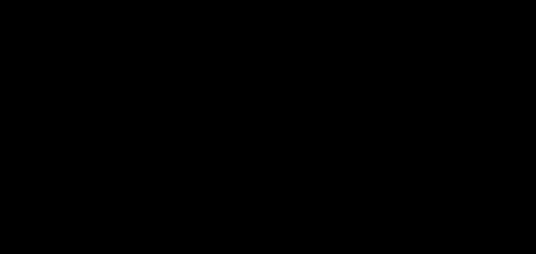

# digital-rain.js
Canonical Matrix code canvas animation that's easy to add to any webpage.

Duration 3 seconds:  
    

I've tried to be as acurate to the origional Matrix code as possible by only using unicode characters found in the movie. My research shows that the following list of characters is canonical (I did not go through the movie frame-by-frame myself)

### Identified Matrix Code Characters (all mirrored unless noted)

    KANJI: "日" (roughly meaning day/sun)

    HALF-WIDTH KATAKANA: "ﾊﾐﾋｰｳｼﾅﾓﾆｻﾜﾂｵﾘｱﾎﾃﾏｹﾒｴｶｷﾑﾕﾗｾﾈｽﾀﾇﾍ"
        "ｳｵｹ" has overscore, 
        "ﾈﾎﾔ" has underscore;
        Missing: "ｦｲｸｺｿﾁﾄﾉﾌﾔﾖﾙﾚﾛﾝ"

    ARABIC DIGITS: "012345789", 
        Not Mirrored: "7"
            "3" is upside down, 
            "4" has underscore, 
        Missing: "6"

    LATIN LETTERS (Not Mirrored): "Z" + "THEMARIX" (THE MATRIX)

    Punctuation/Arithmetic/Other: ":・."=*+-<>¦｜ _"

NOTE: for simplicity, currently, all characters are mirrored, and I've omitted the Kanji "日" because it increases the width of each column. 
I would like to correct these innacuracies for a more canonical Matrix code
